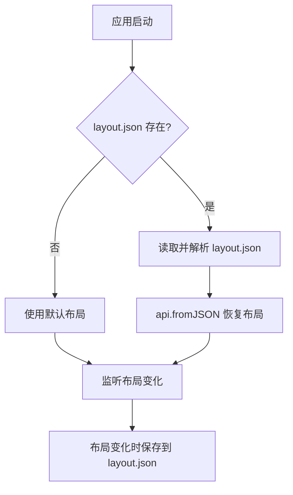

# dockview-layout-persistence design

## 0. 需求摘要

**用户目标**：保存当前 dockview 面板布局（面板位置、大小、显隐状态），下次启动应用时自动恢复到上次保存的状态。

**核心行为**：
1. 布局变化时自动保存到 `~/.config/dawnTerm/layout.json`
2. 应用启动时读取并恢复保存的布局

**成功标准**：
- 调整面板布局后关闭应用，重新打开时布局恢复原样
- 首次启动（无 layout.json）时使用默认布局正常工作
- layout.json 文件格式正确，可被 dockview 的 fromJSON 解析

**明确不做**：
- 不做手动保存/恢复按钮（自动保存）
- 不做多配置文件管理（只保存一份）
- 不做布局导入导出功能
- 不处理 layout.json 损坏时的回退（直接使用默认布局）

## 1. 决策与约束

**放置位置**：布局持久化逻辑属于应用初始化流程的一部分，应在 `App.tsx` 中实现。Electrobun 是桌面框架，可以直接使用 Node.js 的 `fs` 模块读写文件。

**文件路径**：使用 Electrobun 提供的 API 或 Node.js 的 `os.homedir()` 获取用户主目录，拼接 `.config/dawnTerm/layout.json`。

**复杂度档位**：走默认档位。这是简单的文件读写操作，不涉及高并发或复杂状态管理。

**术语锁定**：
- `layout`：dockview 的序列化状态，由 `api.toJSON()` 返回
- `configDir`：用户配置目录 `~/.config/dawnTerm/`

## 2. 方案详情

### 2.1 名词层

**现状**：
- dockview 布局状态由 `DockviewApi` 管理，可通过 `api.toJSON()` 序列化为 JSON 对象
- 布局状态包含：面板位置、大小、分组信息、edge group 状态

**变化**：
- 新增 `LayoutStorage` 工具模块，负责布局的保存和加载
- 新增类型定义：`LayoutData`（即 dockview 的序列化格式）

**接口示例**：
```typescript
// 保存布局
await LayoutStorage.save(api.toJSON())

// 加载布局
const layout = await LayoutStorage.load()
if (layout) {
  api.fromJSON(layout)
}
```

### 2.2 编排层

**主流程**：



**流程级约束**：
1. 保存操作是异步的，不阻塞 UI
2. 保存失败时静默处理，不影响用户体验
3. 恢复失败时回退到默认布局，不抛出异常
4. 使用 debounce 避免频繁保存（布局拖拽时会连续触发）
5. **目录自动创建**：`~/.config/dawnTerm/` 目录可能不存在，保存前需递归创建（`fs.mkdir` with `recursive: true`）

### 2.3 挂载点

1. **App.tsx: onReady 事件** — 应用启动时加载布局
2. **App.tsx: onDidLayoutChange 事件** — 布局变化时保存
3. **LayoutStorage 模块** — 新文件，封装文件读写逻辑

### 2.4 推进策略

1. **编排骨架**：实现 LayoutStorage 模块的基本结构（save/load 方法）
2. **计算节点**：实现文件路径计算、JSON 序列化/反序列化
3. **持久化**：集成到 App.tsx，连接 onReady 和 onDidLayoutChange 事件
4. **测试验证**：手动测试布局保存和恢复功能

### 2.5 结构健康度与微重构

**文件级评估**：
- `App.tsx` 当前 101 行，职责清晰（dockview 初始化 + 面板管理），新增布局持久化逻辑不会导致文件过胖
- 布局读写逻辑独立成 `LayoutStorage` 模块，保持单一职责

**目录级评估**：
- `src/mainview/` 目录结构合理，新文件放在 `src/mainview/utils/` 或 `src/mainview/services/` 合适
- 当前没有 utils 目录，建议新建 `src/mainview/utils/` 存放 LayoutStorage

**结论**：本次不做微重构。App.tsx 尚未过胖，新逻辑独立成模块即可。新增 `src/mainview/utils/` 目录是自然扩展，不需要重组。

## 3. 验收契约

| 场景 | 触发 | 期望结果 |
|------|------|----------|
| 首次启动 | 删除 layout.json 后启动应用 | 应用正常启动，使用默认布局 |
| 目录不存在 | 删除 `~/.config/dawnTerm/` 目录后启动 | 应用正常启动，保存布局时自动创建目录 |
| 保存布局 | 拖拽面板改变布局 | layout.json 文件更新，内容为有效 JSON |
| 恢复布局 | 关闭应用后重新打开 | 布局恢复到上次保存的状态 |
| Edge group 状态 | 切换 edge group 显隐 | 重启后 edge group 显隐状态恢复 |
| 损坏的 layout.json | 写入无效 JSON 后启动 | 应用正常启动，使用默认布局 |
| 保存失败 | layout.json 设为只读 | 应用正常运行，布局变化不保存但不报错 |

**明确不做反向核对**：
- 不验证 layout.json 的内容是否"合理"（只验证是否为有效 JSON）
- 不做布局版本迁移（假设 dockview 版本不变）

## 4. 变更影响

**新增文件**：
- `src/mainview/utils/LayoutStorage.ts` — 布局存储模块

**修改文件**：
- `src/mainview/App.tsx` — 集成布局保存/恢复逻辑

**架构文档更新**：
- `ARCHITECTURE.md` — 新增 LayoutStorage 模块说明

**无 roadmap 关联**：本 feature 是独立需求，不依赖 roadmap。
