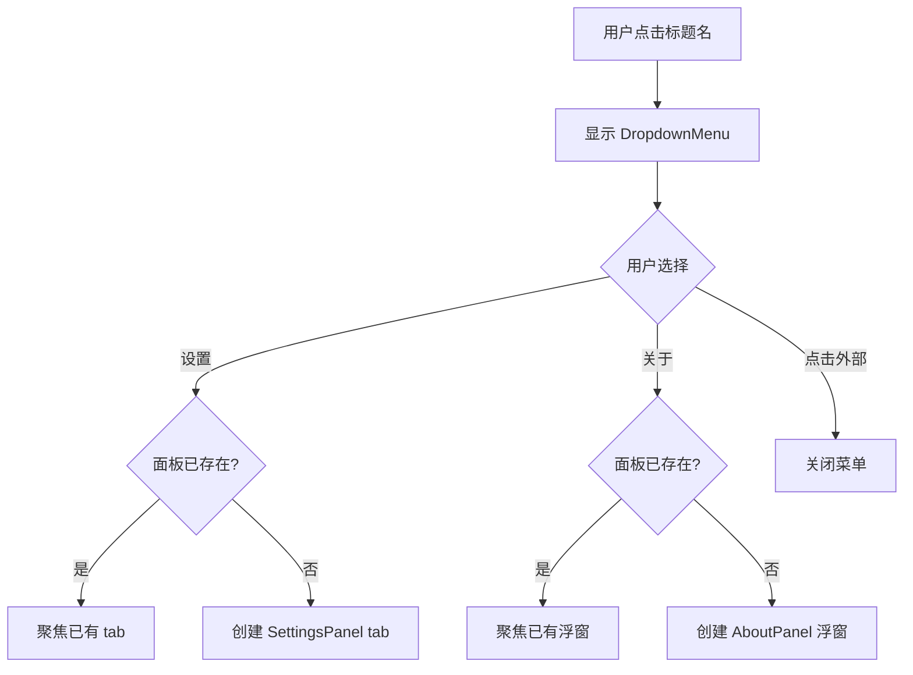

# name-dropdown-menu design

## 0. 术语约定

| 术语 | 定义 | 防冲突结论 |
|------|------|-----------|
| DropdownMenu | 点击标题名后弹出的下拉菜单组件 | 新概念，无冲突 |
| SettingsPanel | 设置页面的 dockview 面板组件 | 新概念，无冲突 |
| AboutPanel | 关于页面的 dockview 面板组件 | 新概念，无冲突 |
| floating panel | dockview 的浮动面板模式，脱离 tab 栏悬浮在窗口中间 | dockview 术语 |

## 1. 决策与约束

### 需求摘要

- **做什么**：TitleBar 的标题文字可点击，弹出下拉菜单；菜单包含"设置"和"关于"两项
- **为谁**：桌面应用用户
- **成功标准**：
  - 点击标题名 → 下拉菜单出现在标题下方
  - 点击"设置" → dockview 新增一个 tab（SettingsPanel）
  - 点击"关于" → dockview 创建一个悬浮在中间的浮动面板（AboutPanel）
  - 点击菜单外部 → 菜单关闭
  - 重复点击"设置"/"关于" → 已有面板则聚焦，不重复创建
- **明确不做**：
  - 不做菜单动画效果（后续 feature）
  - 不做设置页面的实际功能内容（只展示占位）
  - 不做关于页面的实际内容（只展示占位）
  - 不做菜单项的图标装饰
  - 不做自建菜单的 click-outside / Escape / 焦点管理逻辑（由 Headless UI 处理）
  - 组件样式不硬编码颜色值，统一使用 `--dt-*` CSS 变量

### 复杂度档位

走默认档位，无偏离。

### 关键决策

1. **使用无头组件库 `@headlessui/react` 实现下拉菜单**
   - 原因：自建菜单需处理焦点管理、键盘导航、click-outside、aria 无障碍等边界情况，容易出 bug；无头组件库提供行为层，样式完全自定义
   - 替代方案：`@radix-ui/react-dropdown-menu`（更重）、自建（维护成本高）
   - 影响：安装 `@headlessui/react`，使用其 `Menu` 组件；样式用 Tailwind class 自定义

2. **统一主题变量注入：CSS Variables + Tailwind `@theme`**
   - 原因：dockview 使用 `dockview-theme-abyss` 主题，项目后续要做主题系统，需要一套统一的 CSS 变量层让所有组件（含 dockview）共享颜色/间距/字体
   - 替代方案：每个组件各自写死颜色（不可持续）、用 Tailwind `dark:` 前缀（不够灵活）
   - 影响：在 `style.css` 中通过 `@theme` 定义项目级 CSS 变量（`--dt-bg-*`、`--dt-text-*` 等），dockview 主题覆盖变量、自定义组件引用同一套变量。`dt` = `dawn-term` 前缀防冲突

3. **dockview api 通过 props 从 App 传入 TitleBar**
   - 原因：TitleBar 需要调用 `api.addPanel()` 创建面板，api 在 `onReady` 回调中获得
   - 替代方案：用 React Context 全局共享 api，但当前只有 TitleBar 一个消费者，过度设计
   - 影响：App.tsx 需维护 `apiRef` 并传给 TitleBar

4. **面板去重策略：用 id 判断，已有则 `api.getPanel(id).api.setActive()`**
   - 原因：避免重复创建同名面板
   - 替代方案：每次都新建，但会导致多个设置/关于 tab 堆积
   - 影响：SettingsPanel 和 AboutPanel 各有固定 id

### 前置依赖

无。

## 2. 名词与编排

### 2.1 名词层

#### 现状

- TitleBar 组件：显示标题文字 + 窗口控制按钮，标题文字是纯 `<span>`，无交互（`src/mainview/components/TitleBar.tsx:51`）
- App.tsx：持有 dockview api（`onReady` 回调内），创建 2 个占位面板，api 未传出（`src/mainview/App.tsx:12-19`）
- 无下拉菜单组件
- 无设置/关于面板组件

#### 变化

| 动机 | 变化 |
|------|------|
| 标题可点击弹出菜单 | TitleBar 新增 `onMenuAction` 回调 prop，标题区域改为可点击按钮 |
| 需要创建 dockview 面板 | App.tsx 保存 `apiRef`，传 `api` 给 TitleBar |
| 下拉菜单用无头组件实现 | 新增 `src/mainview/components/DropdownMenu.tsx`（基于 `@headlessui/react` 的 `Menu`） |
| 设置面板 | 新增 `src/mainview/components/panels/SettingsPanel.tsx` |
| 关于面板 | 新增 `src/mainview/components/panels/AboutPanel.tsx` |
| 统一主题变量 | `src/mainview/style.css` 新增 `@theme` 块定义 `--dt-*` CSS 变量 |

#### 接口示例

```tsx
// DropdownMenu 组件接口（基于 @headlessui/react Menu）
// 来源：新增组件
import { Menu, MenuButton, MenuItems, MenuItem } from '@headlessui/react'

// TitleBar 内使用
<Menu>
  <MenuButton className="titlebar-title-btn">{title}</MenuButton>
  <MenuItems className="dropdown-menu" anchor="bottom start">
    <MenuItem>
      {({ active }) => <button className={active ? 'dropdown-item-active' : 'dropdown-item'}>设置</button>}
    </MenuItem>
    <MenuItem>
      {({ active }) => <button className={active ? 'dropdown-item-active' : 'dropdown-item'}>关于</button>}
    </MenuItem>
  </MenuItems>
</Menu>

// TitleBar 新增 props
// 来源：修改 src/mainview/components/TitleBar.tsx
interface TitleBarProps {
  title: string
  api?: DockviewApi  // dockview api，用于创建面板
}
```

```css
/* 项目级主题变量（style.css @theme 块）
   来源：修改 src/mainview/style.css
   dt = dawn-tier 前缀，dockview 主题和自定义组件共享 */
@theme {
  --dt-bg-primary: #1a1a2e;
  --dt-bg-secondary: #16213e;
  --dt-bg-surface: #0f3460;
  --dt-text-primary: #e0e0e0;
  --dt-text-secondary: #a0a0a0;
  --dt-border: #2a2a4a;
  --dt-accent: #4a9eff;
  --dt-danger: #e81123;
}
```

### 2.2 编排层

#### 主流程图



#### 现状

- 标题文字 `<span>` 无点击事件
- dockview `onReady` 内创建面板，api 不传出
- 无菜单交互逻辑

#### 变化

- 标题区域改为可点击元素，点击切换菜单显隐
- `onReady` 保存 api 到 ref，通过 props 传给 TitleBar
- TitleBar 收到 `api` 后调用 `api.addPanel()` 创建面板
- 菜单行为由 `@headlessui/react` 的 `Menu` 组件内置处理：click-outside 关闭、Escape 关闭、焦点管理、键盘导航

#### 流程级约束

- 面板去重：创建前用 `api.getPanel(id)` 检查，已有则 `setActive()` 返回
- 浮窗定位：AboutPanel 使用 dockview 的 `position` 选项创建浮动面板
- 菜单关闭：Headless UI 内置处理 click-outside 和 Escape，无需自建逻辑
- 主题一致性：所有自定义组件使用 `--dt-*` CSS 变量，不硬编码颜色值

### 2.3 挂载点清单

| 挂载位置 | 具体文件或配置 key | 动作 |
|---------|-------------------|------|
| dockview 面板组件注册 | `src/mainview/App.tsx` 的 `components` 对象 | 修改：新增 SettingsPanel、AboutPanel |
| TitleBar 菜单交互 | `src/mainview/components/TitleBar.tsx` | 修改：标题可点击 + Headless UI Menu |
| 下拉菜单 UI | `src/mainview/components/DropdownMenu.tsx` | 新增（基于 @headlessui/react） |
| 设置面板 | `src/mainview/components/panels/SettingsPanel.tsx` | 新增 |
| 关于面板 | `src/mainview/components/panels/AboutPanel.tsx` | 新增 |
| 项目主题变量 | `src/mainview/style.css` 的 `@theme` 块 | 修改：新增 `--dt-*` CSS 变量 |

### 2.4 推进策略

```
1. 主题变量 + 依赖安装：@headlessui/react + style.css @theme 块
   退出信号：`--dt-*` 变量在浏览器生效，headlessui 安装完成
2. 静态结构：DropdownMenu（Headless UI Menu）+ TitleBar 标题可点击
   退出信号：点击标题能看到菜单弹出，Escape/外部点击可关闭
3. dockview 面板接入：App 传 api 给 TitleBar + SettingsPanel/AboutPanel 创建
   退出信号：点击"设置"新增 tab，点击"关于"新增浮窗
4. 面板去重 + 样式收尾：已有面板聚焦 + 菜单/面板样式统一用 --dt-* 变量
   退出信号：重复点击不创建新面板，视觉效果与 dockview 主题一致
```

### 2.5 结构健康度与微重构

#### 评估

- 文件级 — `src/mainview/components/TitleBar.tsx`：当前 68 行，职责单一（窗口标题 + 窗口控制），健康。本次新增菜单交互逻辑，预计增加 ~30 行，仍在合理范围。
- 文件级 — `src/mainview/App.tsx`：当前 33 行，职责单一（布局 + dockview 配置），健康。本次新增 api 保存和面板组件注册，预计增加 ~15 行。
- 目录级 — `src/mainview/components/`：当前仅 1 个文件（TitleBar.tsx），本次新增 3 个文件（DropdownMenu.tsx + panels/SettingsPanel.tsx + panels/AboutPanel.tsx）。建议 panels 放子目录，保持 components 整洁。

#### 结论：不做

原因：两个要改的文件都很健康（<100 行），改动量小。新增文件用子目录 `panels/` 组织即可，不需要微重构。

## 3. 验收契约

### 关键场景清单

| 场景 | 输入/触发 | 期望可观察结果 |
|------|----------|---------------|
| 菜单弹出 | 点击标题名 | 标题下方出现下拉菜单，含"设置"和"关于"两项 |
| 菜单关闭（外部点击） | 菜单打开后点击窗口其他区域 | 菜单关闭（Headless UI 内置） |
| 菜单关闭（Escape） | 菜单打开后按 Escape | 菜单关闭（Headless UI 内置） |
| 键盘导航 | 菜单打开后按上下箭头 | 菜单项高亮切换（Headless UI 内置） |
| 打开设置 | 点击菜单"设置" | dockview 新增一个标题为"设置"的 tab，菜单关闭 |
| 打开关于 | 点击菜单"关于" | dockview 创建一个悬浮在中间的面板，标题为"关于"，菜单关闭 |
| 设置去重 | 已有设置 tab 时再次点击"设置" | 已有 tab 被聚焦（切换到该 tab），不创建新面板 |
| 关于去重 | 已有关于浮窗时再次点击"关于" | 已有浮窗被聚焦，不创建新面板 |
| 主题一致性 | 菜单和面板显示时 | 颜色使用 `--dt-*` CSS 变量，与 dockview 主题视觉统一 |
| macOS 兼容 | macOS 上点击标题名 | 菜单正常弹出，不与交通灯按钮冲突 |

### 明确不做的反向核对项

- 代码中不应出现菜单动画/过渡效果逻辑
- 代码中不应出现自建的 click-outside / Escape 监听逻辑（由 Headless UI 处理）
- 设置面板不应包含实际设置功能代码
- 关于面板不应包含实际应用信息代码
- 菜单项不应包含图标渲染逻辑
- 自定义组件中不应出现硬编码颜色值（应使用 `--dt-*` CSS 变量）

## 4. 与项目级架构文档的关系

### 需要提炼回 architecture 的内容

- **名词**：DropdownMenu 组件、SettingsPanel / AboutPanel 面板组件、`--dt-*` 主题变量体系 → 架构总入口的"子系统 / 模块索引"
- **流程级约束**：dockview 面板去重策略（id 查重 + setActive）、主题变量使用约束 → 架构总入口的"已知约束"

### 架构文档更新

- `ARCHITECTURE.md` 的"子系统 / 模块索引"新增 DropdownMenu 和 panels 描述
- `ARCHITECTURE.md` 的"已知约束"新增 dockview 面板管理约定和主题变量使用约束

### 关联的已有架构 doc

- `.codestable/architecture/ARCHITECTURE.md`
