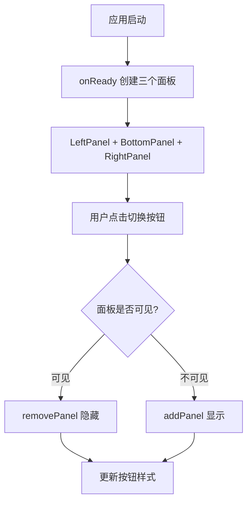

# sidebar-panels design

## 0. 术语约定

| 术语 | 定义 | 防冲突结论 |
|------|------|-----------|
| LeftPanel | dockview 左侧面板，用于文件树/资源管理器 | 新概念，无冲突 |
| BottomPanel | dockview 底部面板，用于终端/输出 | 新概念，无冲突 |
| RightPanel | dockview 右侧面板，用于属性/预览 | 新概念，无冲突 |
| PanelToggle | TitleBar 上控制面板显隐的按钮组 | 新概念，无冲突 |

## 1. 决策与约束

### 需求摘要

- **做什么**：dockview 开启左/底/右三个面板栏，TitleBar 增加三个切换按钮控制显隐
- **为谁**：桌面应用用户
- **成功标准**：
  - 应用启动时显示左/底/右三个面板（默认展开）
  - TitleBar 显示三个切换按钮（左/底/右图标）
  - 点击按钮切换对应面板的显隐状态
  - 面板隐藏时按钮样式变化表示"已隐藏"
- **明确不做**：
  - 不做面板内容（各面板仍用占位内容）
  - 不做面板大小调整（使用 dockview 默认尺寸）
  - 不做面板拖拽重排（后续 feature）
  - 不做面板按钮的工具提示（tooltip）

### 复杂度档位

走默认档位，无偏离。

### 关键决策

1. **使用 dockview 的 edge groups 实现面板定位**
   - 原因：edge groups 是 dockview 原生的边缘面板系统，支持左/右/底三个位置，可控制显隐和折叠
   - 替代方案：使用 `addPanel` + `position`（不是真正的侧边栏，只是普通面板放在边缘）
   - 影响：在 `onReady` 中调用 `addEdgeGroup` 创建三个边缘面板组

2. **面板显隐通过 `setEdgeGroupVisible` 实现**
   - 原因：dockview 原生提供 `setEdgeGroupVisible(position, visible)` API，无需销毁重建
   - 替代方案：使用 `removePanel`/`addPanel`（会导致面板状态丢失）
   - 影响：使用 `isEdgeGroupVisible` 检查状态，`setEdgeGroupVisible` 切换显隐

3. **切换按钮放在 TitleBar 右侧（窗口控制按钮左边）**
   - 原因：左侧已有下拉菜单，右侧放面板切换更合理
   - 替代方案：放在下拉菜单里（多一步操作，不便捷）
   - 影响：TitleBar 新增 `PanelToggle` 组件区域

### 前置依赖

无。

## 2. 名词与编排

### 2.1 名词层

#### 现状

- dockview 配置：`App.tsx:62-66` 使用 `DockviewReact` 组件，只有中间区域面板
- TitleBar：`TitleBar.tsx` 左侧下拉菜单 + 右侧窗口控制按钮
- 无左/底/右面板
- 无面板切换按钮

#### 变化

| 动机 | 变化 |
|------|------|
| 开启左侧面板 | App.tsx `onReady` 中添加 `direction: 'left'` 面板 |
| 开启底部面板 | App.tsx `onReady` 中添加 `direction: 'below'` 面板 |
| 开启右侧面板 | App.tsx `onReady` 中添加 `direction: 'right'` 面板 |
| 切换按钮 | TitleBar 新增 `PanelToggle` 区域，含三个图标按钮 |
| 面板显隐状态 | App.tsx 新增 `panelVisibility` state 管理三个面板的显隐 |

#### 接口示例

```tsx
// PanelToggle 组件接口
// 来源：新增组件
interface PanelToggleProps {
  panels: { id: string; icon: React.ReactNode; visible: boolean }[]
  onToggle: (id: string) => void
}

// App.tsx 中使用
<PanelToggle
  panels={[
    { id: 'left', icon: <PanelLeft size={14} />, visible: leftVisible },
    { id: 'bottom', icon: <PanelBottom size={14} />, visible: bottomVisible },
    { id: 'right', icon: <PanelRight size={14} />, visible: rightVisible },
  ]}
  onToggle={handlePanelToggle}
/>

// Edge group 创建示例
api.addEdgeGroup('left', { id: 'left-edge', initialSize: 200 })
api.addEdgeGroup('bottom', { id: 'bottom-edge', initialSize: 150 })
api.addEdgeGroup('right', { id: 'right-edge', initialSize: 200 })

// 面板显隐切换
api.setEdgeGroupVisible('left', !api.isEdgeGroupVisible('left'))
```

### 2.2 编排层

#### 主流程图



#### 现状

- `onReady` 只创建中间区域面板（panel_1, panel_2）
- TitleBar 无面板切换功能

#### 变化

- `onReady` 创建三个 edge group（left、bottom、right）+ 中间面板
- TitleBar 新增 `PanelToggle` 组件
- App 维护 `panelVisibility` state（从 `isEdgeGroupVisible` 同步）
- `handlePanelToggle` 调用 `setEdgeGroupVisible` 切换显隐

#### 流程级约束

- Edge group 位置固定：`left`、`bottom`、`right`
- 使用 `api.addEdgeGroup(position, { id, initialSize })` 创建
- 使用 `api.setEdgeGroupVisible(position, visible)` 切换显隐
- 使用 `api.isEdgeGroupVisible(position)` 检查状态
- 按钮样式：可见时正常样式，不可见时降低透明度

### 2.3 挂载点清单

| 挂载位置 | 具体文件或配置 key | 动作 |
|---------|-------------------|------|
| dockview edge group 创建 | `src/mainview/App.tsx` 的 `onReady` | 修改：新增三个 edge group |
| 面板显隐状态 | `src/mainview/App.tsx` 的 `panelVisibility` state | 新增 |
| 面板切换处理 | `src/mainview/App.tsx` 的 `handlePanelToggle` | 新增 |
| PanelToggle 组件 | `src/mainview/components/PanelToggle.tsx` | 新增 |
| TitleBar 集成 | `src/mainview/components/TitleBar.tsx` | 修改：新增 PanelToggle 区域 |

### 2.4 推进策略

```
1. 静态结构：PanelToggle 组件 + TitleBar 集成
   退出信号：TitleBar 显示三个切换按钮（无功能）
2. 面板创建：onReady 中创建三个方向面板
   退出信号：应用启动显示左/底/右面板
3. 切换逻辑：handlePanelToggle 实现显隐
   退出信号：点击按钮切换面板显隐，按钮样式随状态变化
4. 样式收尾：按钮激活/非激活样式 + 面板默认尺寸
   退出信号：视觉效果符合预期
```

### 2.5 结构健康度与微重构

#### 评估

- 文件级 — `src/mainview/App.tsx`：当前 70 行，本次新增面板创建和状态管理，预计增加 ~40 行，仍在合理范围
- 文件级 — `src/mainview/components/TitleBar.tsx`：当前 79 行，本次新增 PanelToggle 集成，预计增加 ~10 行
- 目录级 — `src/mainview/components/`：本次新增 1 个文件（PanelToggle.tsx），目录不拥挤

#### 结论：不做

原因：文件健康，改动量小，目录整洁，不需要微重构。

## 3. 验收契约

### 关键场景清单

| 场景 | 输入/触发 | 期望可观察结果 |
|------|----------|---------------|
| 面板显示 | 应用启动 | 左/底/右三个面板默认显示 |
| 左侧面板切换 | 点击左侧面板按钮 | 左侧面板隐藏/显示 |
| 底部面板切换 | 点击底部面板按钮 | 底部面板隐藏/显示 |
| 右侧面板切换 | 点击右侧面板按钮 | 右侧面板隐藏/显示 |
| 按钮状态指示 | 面板隐藏时 | 对应按钮样式变化（降低透明度或不同背景） |
| 面板恢复 | 面板隐藏后再次点击按钮 | 面板恢复到之前位置 |

### 明确不做的反向核对项

- 代码中不应出现面板内容逻辑（仍用占位内容）
- 代码中不应出现面板大小调整逻辑
- 代码中不应出现面板拖拽重排逻辑
- 代码中不应出现 tooltip 逻辑

## 4. 与项目级架构文档的关系

### 需要提炼回 architecture 的内容

- **名词**：LeftPanel、BottomPanel、RightPanel、PanelToggle → 架构总入口的"子系统 / 模块索引"
- **流程级约束**：面板显隐策略（removePanel/addPanel）→ 架构总入口的"已知约束"

### 架构文档更新

- `ARCHITECTURE.md` 的"子系统 / 模块索引"新增 PanelToggle 描述
- `ARCHITECTURE.md` 的"已知约束"新增面板显隐管理约定

### 关联的已有架构 doc

- `.codestable/architecture/ARCHITECTURE.md`
