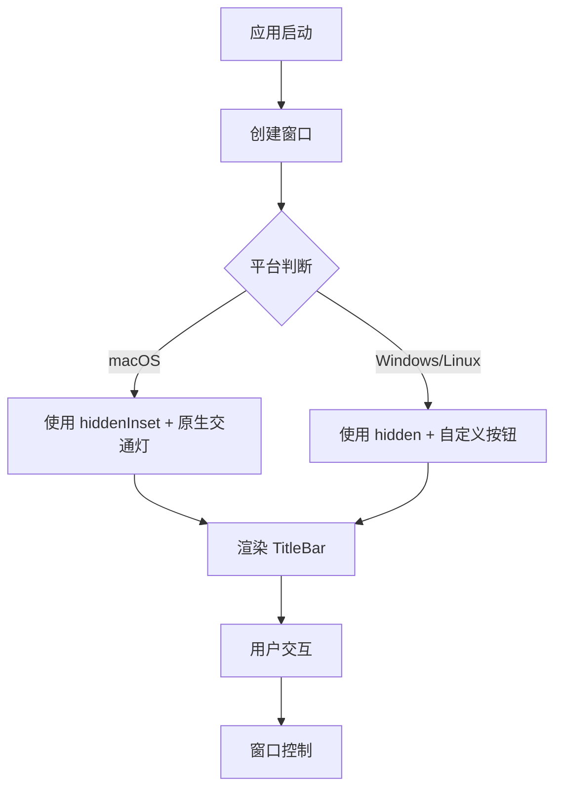

# title-bar design

## 0. 术语约定

| 术语 | 定义 | 防冲突结论 |
|------|------|-----------|
| TitleBar | 窗口顶部的标题栏组件，显示窗口标题和控制按钮 | 新概念，无冲突 |
| 交通灯按钮 | macOS 原生的红黄绿窗口控制按钮（close/minimize/maximize） | macOS 专有术语 |
| hiddenInset | Electrobun 的 titleBarStyle 选项，隐藏标题栏但保留原生交通灯按钮 | Electrobun API 术语 |

## 1. 决策与约束

### 需求摘要

- **做什么**：为 dawn-term 添加自定义 title bar，支持跨平台（macOS/Windows/Linux）
- **为谁**：桌面应用用户
- **成功标准**：
  - macOS 上显示原生交通灯按钮 + 自定义标题区域
  - Windows/Linux 上显示自定义窗口控制按钮（最小化/最大化/关闭）
  - 标题栏可拖动移动窗口
- **明确不做**：
  - 不做窗口圆角自定义（保持系统默认）
  - 不做标题栏按钮自定义（只保留标准窗口控制）
  - 不做标题栏主题切换（后续 feature）

### 复杂度档位

走默认档位，无偏离。

### 关键决策

1. **选择 `titleBarStyle: "hiddenInset"`** 而非 `"hidden"` 或 `"default"`
   - 原因：macOS 上保留原生交通灯按钮，符合平台习惯
   - 替代方案：`"hidden"` 需要完全自定义 macOS 窗口控制，增加复杂度
   - 影响：需要为 Windows/Linux 自定义窗口控制按钮

2. **TitleBar 作为独立组件**
   - 原因：职责单一，便于维护和测试
   - 替代方案：直接在 App.tsx 中实现，但会增加 App 复杂度
   - 影响：新增 `src/mainview/components/TitleBar.tsx`

3. **使用 Electrobun 的窗口控制 API**
   - 原因：跨平台兼容，无需自己实现窗口控制逻辑
   - 替代方案：使用 web API 或自定义实现
   - 影响：需要调用 `window.close()` / `window.minimize()` / `window.maximize()`

### 前置依赖

无。

## 2. 名词与编排

### 2.1 名词层

#### 现状

- 无 TitleBar 组件
- 窗口使用默认 titleBarStyle（`src/bun/index.ts:24-33`）
- 主界面是 DockviewReact 组件（`src/mainview/App.tsx:10-28`）

#### 变化

| 动机 | 变化 |
|------|------|
| 新增 TitleBar 组件 | 创建 `src/mainview/components/TitleBar.tsx`（components 目录） |
| 修改窗口配置 | `src/bun/index.ts` 添加 `titleBarStyle: "hiddenInset"` |
| 调整布局 | `App.tsx` 添加 TitleBar 组件，调整为垂直布局 |

#### 接口示例

```tsx
// TitleBar 组件接口
// 来源：新增组件
interface TitleBarProps {
  title: string
}

// 使用示例
<TitleBar title="dawn-term" />
```

### 2.2 编排层

#### 主流程图



#### 现状

- 应用启动 → 创建默认窗口 → 渲染 DockviewReact
- 无 title bar 相关逻辑

#### 变化

- 窗口创建时设置 `titleBarStyle: "hiddenInset"`
- 新增 TitleBar 组件渲染在顶部
- 调整 App.tsx 布局为垂直 flex（TitleBar + DockviewReact）

#### 流程级约束

- macOS：交通灯按钮位置可通过 `trafficLightOffset` 调整
- Windows/Linux：自定义按钮调用 Electrobun 窗口控制 API
- 标题栏可拖动：使用 `-webkit-app-region: drag` CSS 属性

### 2.3 挂载点清单

| 挂载位置 | 具体文件或配置 key | 动作 |
|---------|-------------------|------|
| 窗口配置 | `src/bun/index.ts` 的 BrowserWindow 选项 | 修改 |
| UI 组件 | `src/mainview/components/TitleBar.tsx` | 新增 |
| 布局入口 | `src/mainview/App.tsx` | 修改 |

### 2.4 推进策略

```
1. 静态结构：TitleBar 组件骨架 + 窗口配置修改
   退出信号：浏览器看到标题栏布局，macOS 显示交通灯按钮
2. 交互逻辑：窗口控制按钮事件绑定
   退出信号：点击按钮能控制窗口（最小化/最大化/关闭）
3. 跨平台适配：平台判断 + Windows/Linux 自定义按钮
   退出信号：三个平台都能正常使用窗口控制
4. 样式收尾：标题栏样式调整 + 可拖动区域
   退出信号：标题栏可拖动，视觉效果符合预期
```

### 2.5 结构健康度与微重构

#### 评估

- 文件级 — `src/mainview/App.tsx`：当前 29 行，职责单一（DockviewReact 配置），健康
- 目录级 — `src/mainview/`：当前 5 个文件，本次新增 1 个组件目录，不摊平

#### 结论：不做

原因：App.tsx 文件健康，目录结构清晰，无需微重构。

## 3. 验收契约

### 关键场景清单

| 场景 | 输入/触发 | 期望可观察结果 |
|------|----------|---------------|
| macOS 交通灯显示 | 启动应用 | 窗口左上角显示红黄绿按钮 |
| 标题显示 | 启动应用 | 标题栏显示 "dawn-term" |
| 关闭窗口 | 点击关闭按钮 | 窗口关闭 |
| 最小化窗口 | 点击最小化按钮 | 窗口最小化 |
| 最大化窗口 | 点击最大化按钮 | 窗口最大化/还原 |
| 拖动窗口 | 拖动标题栏 | 窗口跟随移动 |
| Windows/Linux 控制按钮 | 在 Windows/Linux 上启动 | 显示自定义窗口控制按钮 |

### 明确不做的反向核对项

- 代码中不应出现窗口圆角自定义逻辑
- 代码中不应出现标题栏主题切换逻辑
- 代码中不应出现标题栏按钮自定义配置

## 4. 与项目级架构文档的关系

### 需要提炼回 architecture 的内容

- **名词**：TitleBar 组件 → 架构总入口的"子系统 / 模块索引"
- **流程级约束**：跨平台窗口控制策略 → 架构总入口的"已知约束"

### 架构文档更新

- `ARCHITECTURE.md` 的"子系统 / 模块索引"新增 TitleBar 组件描述
- `ARCHITECTURE.md` 的"已知约束"新增跨平台窗口控制约束

### 关联的已有架构 doc

- `.codestable/architecture/ARCHITECTURE.md`（骨架，待更新）
